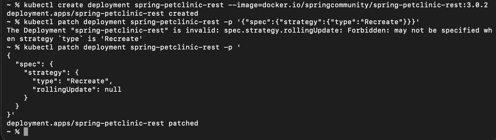
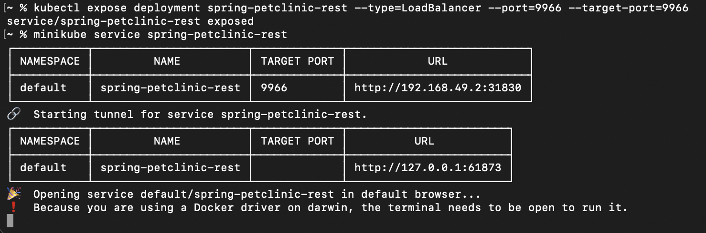
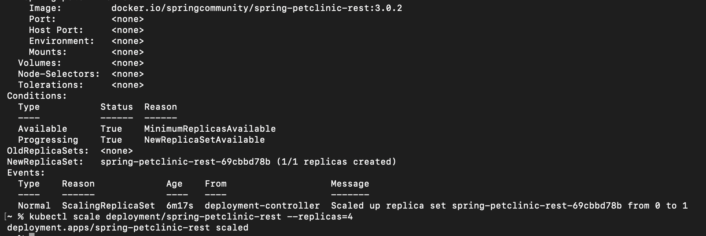
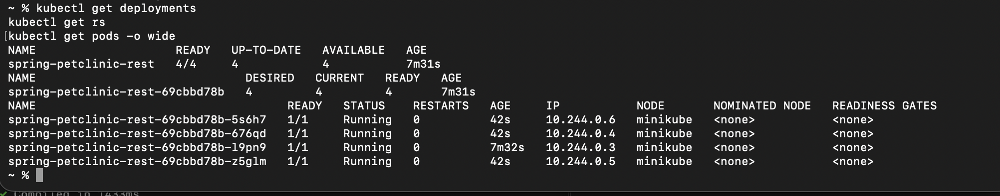
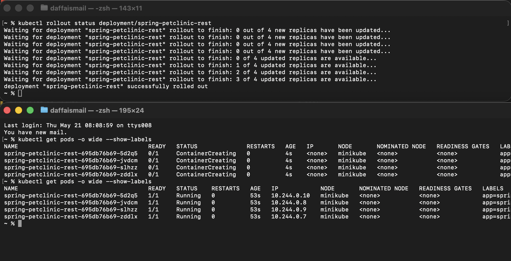
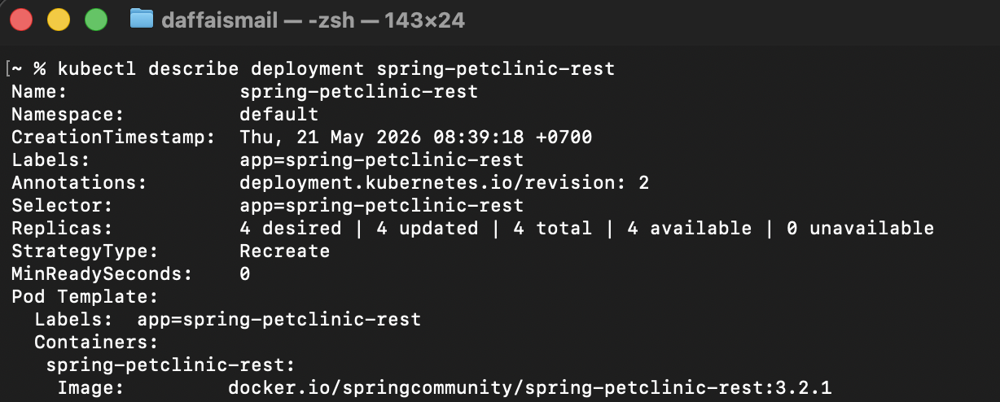
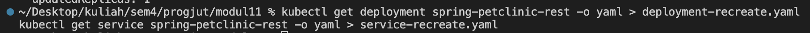
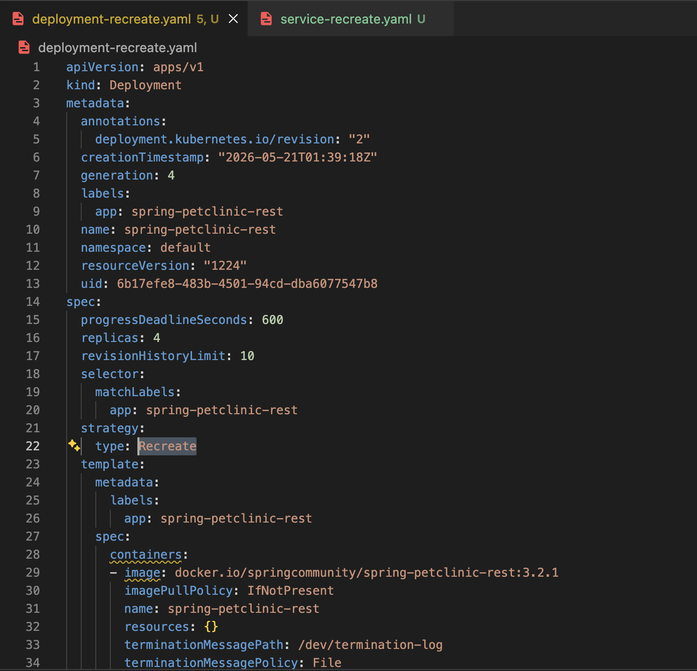
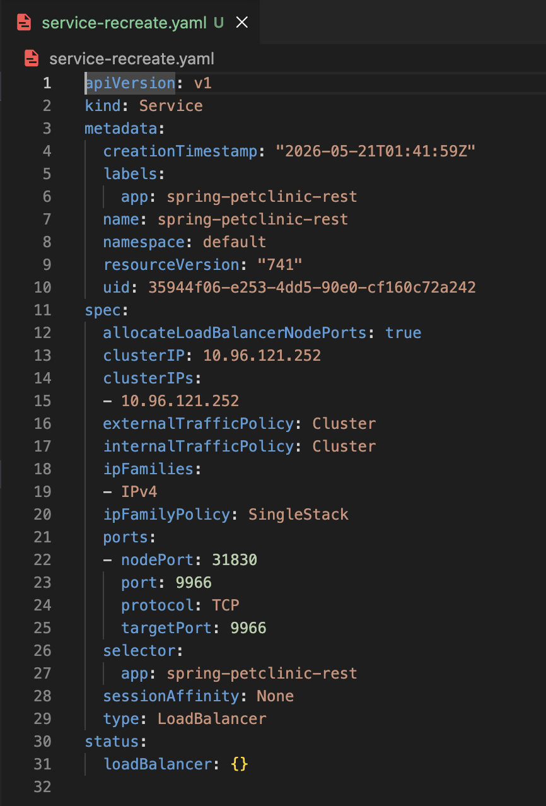

1. Compare the application logs before and after you exposed it as a Service.
Try to open the app several times while the proxy into the Service is running.
What do you see in the logs? Does the number of logs increase each time you open the app?

I see get requests and the date they were received. 

Yes, the logs do increase, each time I visit the page, it logs the get request my browser sends.

2. Notice that there are two versions of `kubectl get` invocation during this tutorial section.
The first does not have any option, while the latter has `-n` option with value set to
`kube-system`.
What is the purpose of the `-n` option and why did the output not list the pods/services that you
explicitly created?

The -n option tells kubectl which namespace to operate in. Created pods/services didnt appear because they are in the namespace "default", and the command with `-n kube-system` listed resources only in the kube-system namespace.

source: https://kubernetes.io/docs/concepts/overview/working-with-objects/namespaces

***

1. What is the difference between Rolling Update and Recreate deployment strategy?

Rolling update gradually replaces old pods with new ones while keeping the application available, removing downtime. 

Recreate stops all old pods first and then starts the new pods, which causes a brief downtime during the rollout.

2. Try deploying the Spring Petclinic REST using Recreate deployment strategy and document your attempt.

creating the deployment and changing to recreate strategy

exposing and opening 

version checking and scaling

verifying replicated pods are working okay

rollout and confirming replace is working correctly

successful version check

3. Prepare different manifest files for executing Recreate deployment strategy.

manifest files for recreate are present in the repo, they are suffixed with -recreate to differentiate from tutorial manifest files

4. What do you think are the benefits of using Kubernetes manifest files? Recall your experience
in deploying the app manually and compare it to your experience when deploying the same app
by applying the manifest files (i.e., invoking `kubectl apply -f` command) to the cluster.

Manifests make deployments repeatable, can be version controlled, and faster. It reduces a lot of manual steps compared to doing the same operations by hand, and being able to reproduce deployments consistently will be very helpful in team work environments.