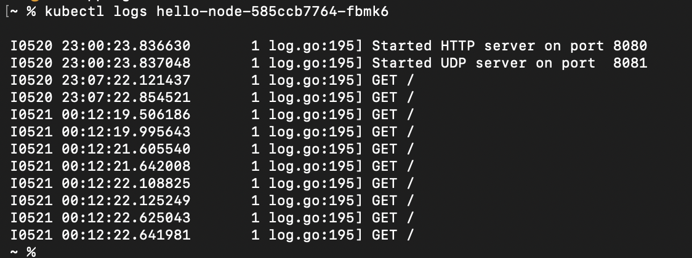

1. Compare the application logs before and after you exposed it as a Service.
Try to open the app several times while the proxy into the Service is running.
What do you see in the logs? Does the number of logs increase each time you open the app?

I see get requests and the date they were received. 

Yes, the logs do increase, each time I visit the page, it logs the get request my browser sends.

2. Notice that there are two versions of `kubectl get` invocation during this tutorial section.
The first does not have any option, while the latter has `-n` option with value set to
`kube-system`.
What is the purpose of the `-n` option and why did the output not list the pods/services that you
explicitly created?

The -n option tells kubectl which namespace to operate in. Created pods/services didnt appear because they are in the namespace "default", and the command with `-n kube-system` listed resources only in the kube-system namespace.

source: https://kubernetes.io/docs/concepts/overview/working-with-objects/namespaces